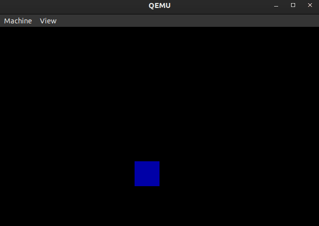

# screensaver-asm

A bouncing square screensaver-like thing in x86 real mode.

This could probably be optimized further, but as of now its 251 bytes.

## Run

`make qemu`

## References

- https://en.wikipedia.org/wiki/BIOS_interrupt_call
- https://en.wikipedia.org/wiki/Mode_13h
- [PC Interrupts: A Programmer's Reference to BIOS, DOS, and Third Party Calls](https://isbnsearch.org/isbn/9780201577976)
